# System Logs Analyzer - Project Report

### Team Members

| S. No. | Name           | Roll no.     | E-mail                               |
|--------|----------------|--------------|--------------------------------------|
| 1.     | Ayush Rawal    | 2024201036   | ayush.rawal@students.iiit.ac.in      |
| 2.     | Niket Mittal   | 2024201076   | niket.mittal@students.iiit.ac.in     |
| 3.     | Piyush Priy    | 2024201005   | piyush.priy@students.iiit.ac.in      |
| 4.     | Prakhar Kesari | 2024202023   | prakhar.kesari@students.iiit.ac.in   |
| 5.     | Akarsh Saxena  | 2024204001   | akarsh.saxena@students.iiit.ac.in    |

### Supervisor

- Sai Anirudh Karre - saianirudh.karre@research.iiit.ac.in

## 1. Project Overview

The System Logs Analyzer is a comprehensive command-line tool designed to
empower system administrators, IT professionals, and security analysts by
providing an interface to analyze system logs, categorizing events into errors,
warnings, and informational logs. The tool aims to provide users with valuable
insights to help diagnose issues, troubleshoot efficiently, and improve system
performance. Modern IT environments rely heavily on system logs for
diagnosing failures, identifying security incidents, and ensuring smooth
operations. However, manually analyzing logs can be time-consuming and error
prone. This project automates log parsing, categorization, and visualization
through a powerful Terminal User Interface (TUI), delivering actionable
insights in real time.

The tool processes logs in real-time from Linux-based systems, categorizing
events by severity (e.g., errors, warnings, informational messages) and
extracting valuable insights such as event frequency, anomaly detection, and
trend analysis. Its focus on concurrent log processing ensures scalability and
performance, even in large-scale environments.

### 1.1. Use Cases

1. Log Parsing and Filtering: Parse system logs and filter events based on
   user-defined criteria, such as date range, severity (error, warning, information), or specific services (e.g., SSH, kernel, authentication).
2. Log Categorization: Automatically categorize logs into predefined categories
   (errors, warnings, information) for easier analysis.
3. Event Frequency Analysis: Track the frequency of certain events (e.g.,
   failed logins, service crashes, network errors) over time to identify recurring issues.
4. Log Trend Visualization: Provide graphical representations (using ASCII
   charts) to visualize trends in system logs, such as spikes in errors or warnings during certain periods.
5. Aggregate Log Data Over Time: Summarize log data over hourly, daily, or
   weekly timeframes to provide high-level insights into system performance.
6. Error and Warning Monitoring: Continuously monitor logs for critical errors
   and warnings, notifying users of potential system issues in real-time.
7. Security Incident Detection: Identify and highlight potential security
   issues such as unauthorized access attempts or suspicious activity within the logs.
8. Service Health Monitoring: Analyze logs from key services (e.g., web server,
   database server) to assess overall system health and detect anomalies.
9. TUI Interface for Non-Technical Users: Provide a user-friendly TUI interface
   that allows users, including non-technical staff, to interact with logs, view summaries, and navigate through different sections without needing to know complex commands.

## 2. Implementation

### 2.1 Technology Stack
- Golang as the programming language of choice
- BubbleTea as the TUI framework
- LipGloss as the styling framework
- Bubbles for UI Components
- ntcharts for graphs and charts
- go-systemd to monitor local system logs

### 2.3 Inputs

- System logs from Linux-based machines (e.g., /var/log/syslog, /var/log/kern.log, etc.)

### 2.4 Outputs

- Processed and categorized logs by event type (errors, warnings, information)
- Visual and numerical representation of log trends over time, including:
  - Textual output: Summarized logs
  - Graphical representation: Charts displaying event frequency
  - Numerical analysis: Statistics of event occurrences over time

### 2.5 Assumptions

- This tool assumes that the log files are primarily from Linux based systems
- This tool assumes the log files to be in a particular format, specifically: 
`timestamp hostname process: message`
- User of this tool as some experience with TUI applications
- User has basic technical knowledge of system administration

## 3. Control Flow / Data Flow

1. Log File Reading: The system will scan and load the provided log files. In case no log files are provided local system logs are processed
2. Log Parsing & Filtering: Parsing logs to extract relevant details such as timestamps, process name, log levels and events.
3. Log Categorization: Group logs into categories such as errors, warnings, and information.
4. Interactive CLI: A command-line interface for interacting with the system, displaying analysis through graphs, statistics, and summaries.

{height=820px}

## 4. Project Evolution

### 4.1 Phase 1

This phase laid the foundation for the entire project by defining the goals,
objectives, and scope. The focus was on understanding user needs, determining
technical requirements, and outlining the development strategy.

- **Requirement Gathering:**

    The primary focus was identifying the needs of system administrators and IT
    personnel. Extensive research was conducted to understand the types of logs
    commonly analyzed and the insights users seek, such as error detection, trend
    analysis, and performance metrics.

- **Defining Project Scope:**

    A clear scope was established to focus on core functionalities like real-time
    log monitoring, log parsing, and visualization within a terminal interface.
    Features like web interfaces and persistent storage were considered for future
    iterations.

- **System Architecture Conceptualization:**

    The initial architecture was designed to support concurrency, scalability, and
    flexibility. A modular design ensured that log parsing, data analysis, and
    visualization components could be developed and tested independently.

- **User Interface Design:**

    Early mockups of the Terminal User Interface (TUI) were created to envision how
    logs would be displayed, including color-coded outputs and interactive elements
    for filtering and navigating logs.

- **Project Timeline and Team Responsibilities:**

    A project timeline was established, dividing the work into weekly sprints. Team
    members were assigned specific roles based on their expertise, ensuring
    efficient task distribution and accountability.

### 4.2 Phase 2

The second phase focused on building the core components of the System Logs
Analyzer, including the log parsing engine and initial TUI implementation

- **Log Processing Engine**
    - Implemented real-time log monitoring system using Go
    - Created rudimentary log parsing using regular expressions
    - Developed categorization system for different types of log entries
    - Added support for various memory-related log categories:
      - Out of memory errors
      - Memory allocation failures
      - Low memory conditions
      - OOM-killer invocations
      - Service management events

- **Terminal User Interface (TUI)**
    - Implemented full-featured TUI using Bubble Tea framework
    - Created tabbed interface for different log categories (Errors, Warnings, Information)
    - Added search functionality with real-time filtering
    - Implemented date range filtering
    - Added keyboard-driven navigation
    - Created help system with keyboard shortcuts
    - Implemented responsive design that adapts to terminal size

### 4.3 Final Phase

In the final phase, the focus shifted to refining the system, optimizing
performance, adding visualisations, improving categorisation logic, adding
features to the interface and conducting thorough testing.

- **Improvements to application usage**
    - The application can now take multiple files as command line argument and proceeses them as a single file
    - In case of no command line arguments, the application defaults to the local logs of the system

- **Improvements to Log Categorization**
    - More robust categorsing logic was devised and implemented
    - The system was refactored so as to allow easy modification of the categorisation heuristics
    - Process information was extracted to provide better analysis

- **Improvements to Terminal User Interface**
    - The TUI was refined so as to look more polished and easy to use
    - Visualisations were added to facilitate analysis

- **Added Visualisations**
    - Visualisations such as bar charts were added for easy interpretation

- **General Improvements**
    - The code of the application was refactored so as to improve readability and maintainability
    - The code was divided into modules to separate application logic
    - The application was thoroughly tested and encountered bugs were removed

## 5. Source Code
- This project is open source and available under MIT License
- The source code can be found here [https://github.com/SystemLogAnalyser/app](https://github.com/SystemLogAnalyser/app)

## 6. Video Demo
- A demo video showcasing the project can be found here: [Video](https://iiitaphyd-my.sharepoint.com/:f:/g/personal/ayush_rawal_students_iiit_ac_in/EvZ1m3Gr-DxMh519_2N5JjQBCh2uMTwtmvwmEjomDES4Xw)

## 7. Team Member Contributions

The development of the System Logs Analyzer was a collaborative effort among
five dedicated team members, each contributing unique skills and expertise.
Under the guidance of Dr. Sai Anirudh Karre, the team successfully delivered a
robust tool for system log analysis, ensuring efficiency, scalability, and
user-friendliness.

  
  
  

| Team Member    | Contributions                                                                                       |
|-------------   |---------------                                                                                      |
| Ayush Rawal    | TUI Implementation, Integration of categorizing, TUI and visualization logic and Local log analysis |
| Niket Mittal   | System Architecture, Log Parsing and Categorisation                                                 |
| Piyush Priy    | Requirement Gathering, Log Categorisation Heuristics and Testing                                    |
| Prakhar Kesari | TUI Design, Bug fixing, UX improvements and Visualisation                                           |
| Akarsh Saxena  | Testing, Requirement Gathering, Documentation                                                       |
